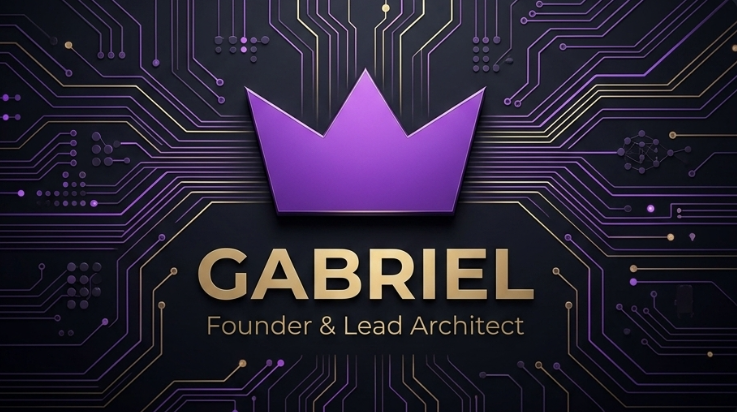

  

 

  
"Transformando ideias em ecossistemas, e código em infraestrutura."

  
Explorador da interseção entre o Business e a Engenharia de Software. Criador de tecnologias independentes e apaixonado por arquiteturas originais.

## O Ecossistema (Meus Estúdios)

<table border="0">
  <tr>
    <td width="50%">
      
      <h3>Liz Ai Studio</h3>
      
Laboratório de inovação focado em Inteligência Artificial nativa e soberania tecnológica.

    </td>
    <td width="50%">
      <h3>Lux Games Studio</h3>
      
Onde a criatividade e o design se encontram com a engenharia de jogos para criar experiências imersivas.

    </td>
  </tr>
</table>

## Inovações de Core (Flagships)

### Liz Ai
> **A IA com DNA Próprio.**
Diferente da maioria, a **Liz Ai** é uma inteligência artificial nativa com infraestrutura independente. Possui sua própria **API Proprietária**, não dependendo de modelos externos (GPT/Claude) para funcionar, garantindo total controle sobre a arquitetura e dados.

### Ae (Liz Aether)

> **Minha Linguagem de Programação.**
Não me contento com o que já existe. Estou desenvolvendo a **Ae**, uma linguagem criada para redefinir limites de performance e flexibilidade, unindo a visão de arquitetura da Liz com a eficiência moderna.

## Arsenal Técnico Estratégico

  

## 📈 Analytics de Desenvolvimento

  
   
  

## Conecte-se com o Fundador

  
  
  

 

  

